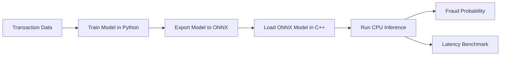
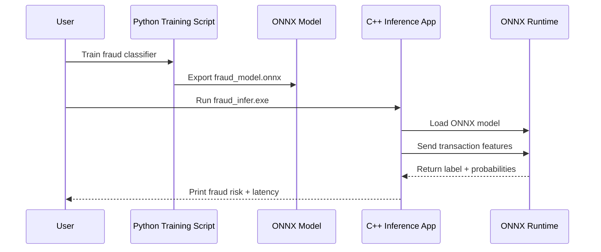

# C++ Fraud Detection Inference System


A compact ML deployment project that takes a fraud-detection model from **Python training** to **C++ inference** using ONNX Runtime.

Instead of stopping at model training, this project focuses on what happens after the model is built: exporting it, loading it in a native C++ application, running predictions, and measuring inference latency.

---

## Project Pipeline



---

## What This Project Does

This project simulates a simple transaction risk-scoring system.

A fraud-detection model is trained in Python, exported to ONNX, and then executed inside a C++17 application. The C++ program loads the ONNX model, runs local CPU inference, returns the predicted class, prints fraud probability, and reports inference latency.

```text
Transaction Features
        ↓
Python-Trained ML Model
        ↓
ONNX Export
        ↓
C++17 Inference Pipeline
        ↓
Fraud Probability + Latency
```

---

## Tech Stack

| Area              | Tools                      |
| ----------------- | -------------------------- |
| Model Training    | Python, scikit-learn       |
| Model Export      | ONNX, skl2onnx             |
| Inference Runtime | ONNX Runtime               |
| C++ Build         | C++17, CMake, MSVC         |
| Dependency Setup  | NuGet                      |
| Benchmarking      | std::chrono, Python timing |

---

## Key Features

* Trained a fraud-detection classifier in Python
* Exported the trained model into ONNX format
* Loaded and executed the ONNX model using C++17
* Generated fraud probability and prediction label
* Measured local CPU inference latency using `std::chrono`
* Compared C++ ONNX Runtime inference with Python ONNX Runtime

---

## Project Structure

```text
.
├── data/
│   └── sample_transactions.csv
├── models/
│   └── fraud_model.onnx
├── python/
│   ├── train_export_model.py
│   └── benchmark_python.py
├── src/
│   └── main.cpp
├── CMakeLists.txt
├── metrics.json
└── README.md
```

---

## Sample Output

```text
Input name: input
Output 0: label
Output 1: probabilities
Prediction label: 1
Not fraud probability: 0.0467047
Fraud probability: 0.953295
C++ inference latency: 0.2035 ms
```

---

## Benchmark Results

| Runtime             |                   Latency |
| ------------------- | ------------------------: |
| C++ ONNX Runtime    |                 0.2035 ms |
| Python ONNX Runtime | 0.0139 ms per transaction |

Both benchmarks use the same ONNX model. Python ONNX Runtime internally calls optimized native execution, so the comparison is between two ONNX Runtime frontends rather than pure Python vs. pure C++.

The C++ pipeline successfully performs sub-millisecond local CPU inference for transaction risk scoring.

---

## Visual Workflow



---

## How to Run

### 1. Create Python environment

```powershell
python -m venv .venv
.\.venv\Scripts\activate
pip install numpy pandas scikit-learn skl2onnx onnxruntime
```

### 2. Train and export the model

```powershell
python python/train_export_model.py
```

This generates:

```text
models/fraud_model.onnx
```

### 3. Install ONNX Runtime for C++

```powershell
Invoke-WebRequest -Uri "https://dist.nuget.org/win-x86-commandline/latest/nuget.exe" -OutFile ".\nuget.exe"
.\nuget.exe install Microsoft.ML.OnnxRuntime -Version 1.27.0 -OutputDirectory packages
```

### 4. Build the C++ project

```powershell
cmake -S . -B build -DONNXRUNTIME_DIR="<path-to-Microsoft.ML.OnnxRuntime.1.27.0>"
cmake --build build --config Release
```

Example:

```powershell
cmake -S . -B build -DONNXRUNTIME_DIR="C:\Users\Bijal\Desktop\Bijal\Projects\C++ fraud detection\packages\Microsoft.ML.OnnxRuntime.1.27.0"
```

### 5. Run C++ inference

```powershell
.\build\bin\Release\fraud_infer.exe
```

### 6. Run Python benchmark

```powershell
python python/benchmark_python.py
```

---

## What I Learned

This project helped me understand the deployment side of machine learning, especially how trained models can be moved from Python into a native C++ runtime.

Key takeaways:

* Exporting ML models from Python to ONNX
* Running ONNX models in C++
* Building C++ projects with CMake
* Linking native libraries on Windows
* Measuring inference latency with `std::chrono`
* Understanding practical ML inference outside notebooks

---
